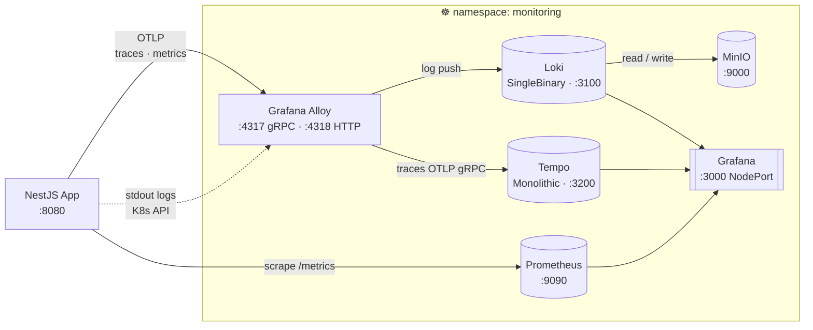
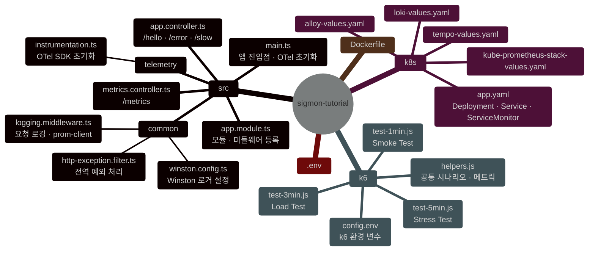
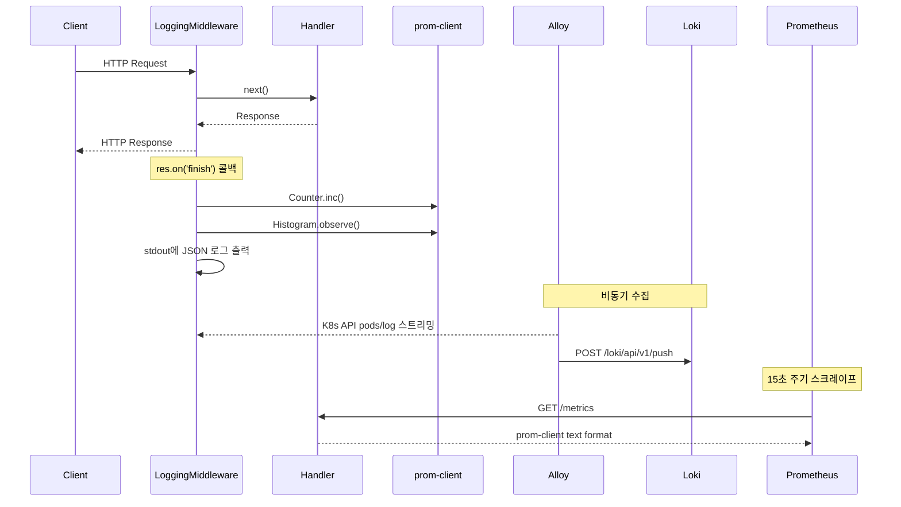
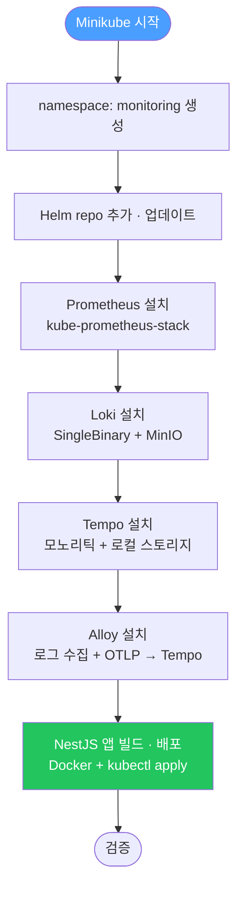
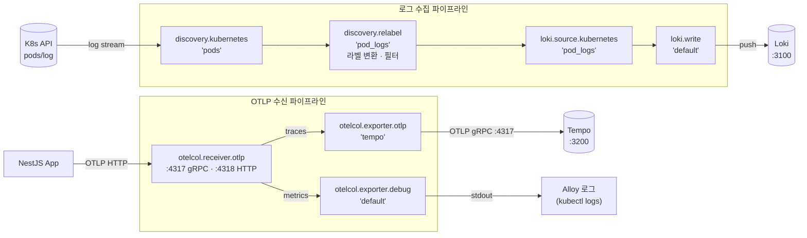
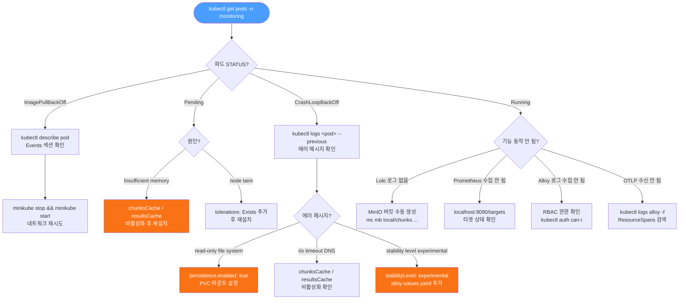

# sigmon-tutorial

NestJS + Prometheus + Loki + Grafana Alloy 를 활용한 **옵저버빌리티 학습 프로젝트**

Minikube 단일 노드 환경에서 메트릭 수집, 로그 집계, 분산 트레이싱 파이프라인을 직접 구성하고 실습한다.

---

## 목차

1. [아키텍처](#아키텍처)
2. [프로젝트 구조](#프로젝트-구조)
3. [NestJS 앱](#nestjs-앱)
4. [Kubernetes 설치 가이드](#kubernetes-설치-가이드)
   - [Minikube Addons 설정](#minikube-addons-설정)
5. [앱 배포 (Minikube)](#앱-배포-minikube)
6. [k6 부하 테스트](#k6-부하-테스트)
7. [Grafana 사용법](#grafana-사용법)
8. [Lens로 클러스터 관리](#lens로-클러스터-관리)
9. [디버그 가이드](#디버그-가이드)

---

## 아키텍처



| 컴포넌트 | 역할 | 포트 |
|---|---|---|
| NestJS App | 샘플 HTTP 서버 (메트릭 / 로그 / 트레이스 생성) | 8080 |
| Grafana Alloy | Pod 로그 수집 → Loki, OTLP 수신 → Tempo | 4317 (gRPC), 4318 (HTTP) |
| Loki | 로그 집계 및 저장 (MinIO 백엔드) | 3100 |
| Tempo | 트레이스 수집 및 저장 (로컬 스토리지) | 3200 (HTTP), 4317 (OTLP) |
| Prometheus | 메트릭 수집 및 저장 | 9090 |
| Grafana | 메트릭 / 로그 / 트레이스 시각화 | 3000 (NodePort) |

### Alloy를 사용하는 이유 — Promtail과의 비교

Grafana Alloy는 **Promtail의 공식 후속 도구**다.
Promtail은 2024년 deprecated 선언되었으며, Grafana는 Alloy로의 마이그레이션을 권장한다.

**Promtail만 사용할 때의 구성:**

```
[로그]   Promtail      → Loki
[트레이스] OTel Collector → Tempo
[메트릭]  Prometheus    → (scrape)
```

에이전트를 신호 유형마다 별도로 운영해야 한다.
Kubernetes에서는 DaemonSet(Promtail) + Deployment(OTel Collector)를 따로 관리하게 된다.

**Alloy를 사용할 때의 구성:**

```
[로그]   Alloy (loki.source.kubernetes)   → Loki
[트레이스] Alloy (otelcol.receiver.otlp)   → Tempo
[메트릭]  Alloy (prometheus.scrape, 선택)  → Prometheus
```

Alloy 하나로 모든 신호를 처리한다. River 언어로 파이프라인 컴포넌트를 조합하는 방식이라
수집 → 변환 → 전달 흐름을 코드로 명시적으로 표현할 수 있다.

| 항목 | Promtail | Grafana Alloy |
|---|---|---|
| 유지보수 상태 | Deprecated (2024) | 활성 개발 중 |
| 처리 가능 신호 | 로그만 | 로그 · 트레이스 · 메트릭 |
| OTLP 수신 | 불가 | 가능 (gRPC 4317 · HTTP 4318) |
| 설정 방식 | YAML | River (컴포넌트 파이프라인) |
| Kubernetes 로그 수집 | DaemonSet 필수 (파일 마운트) | Deployment 가능 (K8s API 스트리밍) |
| 에이전트 수 | 신호 유형마다 별도 | 1개로 통합 |

> **이 프로젝트에서 Alloy를 선택한 핵심 이유:**
> NestJS 앱이 OTLP로 트레이스를 전송하는데, Promtail은 OTLP를 수신할 수 없다.
> Alloy는 로그 수집과 OTLP 수신을 동시에 담당해 에이전트를 하나로 유지한다.

---

## 프로젝트 구조



---

## NestJS 앱

### 엔드포인트

| 메서드 | 경로 | 설명 |
|---|---|---|
| GET | `/hello` | `{ message: "hello" }` 반환, 정상 로그 출력 |
| GET | `/error` | 의도적 에러 발생, 에러 로그 + 500 응답 |
| GET | `/slow` | 300~800ms 랜덤 지연 후 응답 (레이턴시 학습용) |
| GET | `/metrics` | Prometheus 스크레이프 엔드포인트 |

### 요청 처리 흐름



### Prometheus 메트릭

`GET /metrics` 에서 아래 두 메트릭이 노출된다.

```
# 전체 요청 수 (Counter)
nestjs_http_requests_total{method, route, status_code}

# 응답 시간 분포 (Histogram)
nestjs_http_request_duration_seconds{method, route, status_code}
```

**PromQL 예시:**

```promql
# 초당 요청 수 (RPS)
rate(nestjs_http_requests_total[1m])

# 에러율 (5xx 비율)
rate(nestjs_http_requests_total{status_code=~"5.."}[1m])
  / rate(nestjs_http_requests_total[1m])

# 99 퍼센타일 응답 시간
histogram_quantile(0.99, rate(nestjs_http_request_duration_seconds_bucket[5m]))
```

### 로깅 (Winston + Loki 연동)

모든 로그는 **Winston**을 통해 **JSON 구조화 포맷**으로 stdout에 출력된다.
Alloy가 Pod stdout을 수집해 Loki로 전달한다.

로그 레벨은 `.env`의 `LOG_LEVEL`로 조정한다 (기본값: `info`).

**요청 로그 (LoggingMiddleware):**
```json
{
  "level": "info",
  "message": { "method": "GET", "path": "/slow", "route": "/slow", "statusCode": 200, "durationMs": 512 },
  "context": "HTTP",
  "timestamp": "2026-01-01T00:00:00.000+0900"
}
```

**에러 로그 (HttpExceptionFilter):**
```json
{
  "level": "error",
  "message": { "message": "Intentional error for observability testing", "path": "/error", "statusCode": 500 },
  "stack": "Error: Intentional error...",
  "context": "HttpExceptionFilter",
  "timestamp": "2026-01-01T00:00:00.000+0900"
}
```

**LogQL 예시:**

```logql
# monitoring 네임스페이스 전체 로그
{namespace="monitoring"}

# NestJS 앱 에러 로그만 필터
{namespace="default", app="nestjs-sample"} |= "ERROR"

# 응답 시간 500ms 이상 요청 추출
{namespace="default"} | json | durationMs > 500
```

### OpenTelemetry (OTLP)

`src/telemetry/instrumentation.ts` 에서 SDK를 초기화한다.

- **서비스명:** `nestjs-sample`
- **트레이스 전송:** `http://alloy.monitoring.svc.cluster.local:4318/v1/traces`
- **메트릭 전송:** `http://alloy.monitoring.svc.cluster.local:4318/v1/metrics`
- **자동 계측:** HTTP, Express 요청/응답 자동 스팬 생성

> Alloy는 수신한 트레이스를 `otelcol.exporter.otlp "tempo"` 를 통해 Tempo로 전달한다.
> 메트릭은 `otelcol.exporter.debug` 로 Alloy 로그에 출력된다 (`kubectl logs` 로 수신 여부 확인 가능).

---

## Kubernetes 설치 가이드

### 사전 조건

| 도구 | 버전 | 비고 |
|---|---|---|
| Docker Desktop | 4.x+ | macOS 필수 — Minikube docker 드라이버 |
| minikube | v1.32+ | |
| kubectl | v1.28+ | |
| helm | v3.14+ | |

> **macOS — Docker Desktop 메모리 설정 필수**
>
> macOS에서 Minikube는 Docker Desktop을 드라이버로 사용한다.
> `minikube start --memory=8192` 는 Minikube VM에 8GB를 **요청**하는 옵션이지만,
> Docker Desktop 자체에 할당된 메모리가 충분하지 않으면 실제로 8GB를 확보할 수 없다.
>
> `grafana/loki` 차트는 기본값으로 `chunksCache`(memcached)를 활성화하며,
> 이 컨테이너의 리소스 요청값이 **9830Mi(약 9.8GB)** 로 설정되어 있다.
> Docker Desktop 메모리가 부족하면 Minikube가 8GB를 확보하지 못하고,
> `loki-chunks-cache-0` 파드가 `Insufficient memory` 로 `Pending` 상태에 빠진다.
>
> **설정 경로:** Docker Desktop → Settings → Resources → Memory
> → **12 GB 이상**으로 설정 후 Apply & Restart

### 설치 순서



### 1단계 — Minikube 시작

> Docker Desktop을 먼저 실행하고, **Settings → Resources → Memory** 가 12GB 이상인지 확인한다.

```bash
minikube start --memory=8192 --cpus=4

kubectl create namespace monitoring
```

### Minikube Addons 설정

Minikube는 추가 기능을 **addon** 단위로 관리한다. Helm 차트를 설치하기 전에 필요한 addon이 활성화되어 있는지 확인한다.

#### 전체 Addon 목록 확인

```bash
minikube addons list
```

#### 필수 Addon

| Addon | 기본 상태 | 역할 |
|---|---|---|
| `default-storageclass` | ✅ enabled | `standard` StorageClass 제공 |
| `storage-provisioner` | ✅ enabled | hostPath 기반 PVC 동적 프로비저닝 |

이 두 addon은 `minikube start` 시 기본 활성화된다.
비활성화되어 있으면 `loki-values.yaml`(`storageClass: standard`)과 `tempo-values.yaml`(`storageClassName: standard`)에서 요청하는 PVC가 Bound 되지 않는다.

```bash
# 상태 확인 (두 addon 모두 enabled 이어야 한다)
minikube addons list | grep -E "default-storageclass|storage-provisioner"
# | default-storageclass  | minikube | enabled ✅ | addon-manager |
# | storage-provisioner   | minikube | enabled ✅ | addon-manager |

# StorageClass 등록 확인
kubectl get storageclass
# NAME                 PROVISIONER                RECLAIMPOLICY   VOLUMEBINDINGMODE
# standard (default)   k8s.io/minikube-hostpath   Delete          Immediate
```

비활성화된 경우:

```bash
minikube addons enable default-storageclass
minikube addons enable storage-provisioner
```

> **addon이 비활성화되면 발생하는 증상:**
>
> Loki `loki-0` PVC 와 Tempo PVC 가 `Pending` 상태로 남는다.
> PVC 가 `Bound` 되지 않으면 파드가 기동하지 못하고
> `CrashLoopBackOff` → `read-only file system` 에러로 이어진다.
>
> ```bash
> # PVC 상태 확인
> kubectl get pvc -n monitoring
> # NAME                 STATUS    VOLUME   ...
> # storage-loki-0       Pending   (← storageClass 문제)
> # tempo                Pending
> ```

#### 선택 Addon: metrics-server

`kubectl top` 명령으로 파드/노드 실시간 리소스 사용량을 조회할 수 있다.
이 프로젝트는 Prometheus로 메트릭을 수집하므로 필수는 아니다.

```bash
# 활성화
minikube addons enable metrics-server

# 약 30초 후 사용 가능
kubectl top nodes
kubectl top pods -n monitoring
```

#### 이 프로젝트에서 사용하지 않는 Addon

| Addon | 사용하지 않는 이유 |
|---|---|
| `ingress` | 모든 서비스를 NodePort 또는 `kubectl port-forward` 로 접근 |
| `registry` | `eval $(minikube docker-env)` 로 Minikube 내부 Docker 데몬에 직접 이미지 빌드 |
| `dashboard` | Kubernetes GUI 는 Lens 사용 |

### 2단계 — Helm 레포지토리 추가

```bash
helm repo add prometheus-community https://prometheus-community.github.io/helm-charts
helm repo add grafana https://grafana.github.io/helm-charts
helm repo update
```

### 3단계 — Prometheus 설치

```bash
helm install prometheus prometheus-community/kube-prometheus-stack \
  --namespace monitoring \
  --values k8s/kube-prometheus-stack-values.yaml \
  --wait
```

설치 확인:
```bash
kubectl get pods -n monitoring -l "release=prometheus"
```

### 4단계 — Loki 설치

```bash
helm install loki grafana/loki \
  --namespace monitoring \
  --values k8s/loki-values.yaml \
  --wait --timeout 5m
```

설치 확인:
```bash
# loki-0 (SingleBinary) 와 loki-minio-* 두 파드가 Running 이어야 함
kubectl get pods -n monitoring -l "app.kubernetes.io/name=loki"

# 헬스체크
kubectl exec -n monitoring loki-0 -- wget -qO- http://localhost:3100/ready
# 출력: ready
```

### 5단계 — Tempo 설치

> **`level=WARN msg="this chart is deprecated"` 경고에 대해**
>
> `grafana/tempo` 차트는 공식 deprecated 처리되었다. 후속 차트는 `grafana/tempo-distributed`이지만,
> 분산 모드용 설계라 distributor · ingester · querier 등 여러 컴포넌트를 별도 파드로 띄우고
> **ReadWriteMany PVC 또는 공유 오브젝트 스토리지(S3)가 필요**하다.
> Minikube 기본 StorageClass(hostPath)는 ReadWriteOnce만 지원하므로 `tempo-distributed`는 단일 노드에서 동작하지 않는다.
>
> `grafana/tempo` 차트는 deprecated 경고만 출력될 뿐 기능은 정상 동작한다.
> 학습 환경에서는 이 경고를 무시하고 그대로 사용한다.

```bash
helm install tempo grafana/tempo \
  --namespace monitoring \
  --values k8s/tempo-values.yaml \
  --wait
```

설치 확인:
```bash
kubectl get pods -n monitoring -l "app.kubernetes.io/name=tempo"

# 헬스체크 (200 OK 반환)
kubectl exec -n monitoring deployment/tempo -- wget -qO- http://localhost:3200/ready
# 출력: ready
```

### 6단계 — Alloy 설치

```bash
helm install alloy grafana/alloy \
  --namespace monitoring \
  --values k8s/alloy-values.yaml \
  --wait
```

### 7단계 — 전체 상태 확인

```bash
kubectl get pods -n monitoring
kubectl get svc  -n monitoring
```

### Alloy River 파이프라인 구조



---

## 앱 배포 (Minikube)

Prometheus 스크레이프, Loki 로그 수집, Alloy OTLP 전송이 모두 동작하려면
NestJS 앱이 Minikube 클러스터 안에서 실행되어야 한다.

### 1단계 — 환경 변수 확인

`.env` 파일로 포트와 로그 레벨을 설정한다.

```bash
# .env (기본값)
PORT=8080
LOG_LEVEL=info
```

### 2단계 — Minikube Docker 환경으로 이미지 빌드

```bash
# Minikube 내부 Docker 데몬을 사용 (이미지를 직접 클러스터에 적재)
eval $(minikube docker-env)

docker build -t nestjs-app:latest .
```

### 3단계 — k8s 매니페스트 배포

`k8s/app.yaml` 에 Deployment · Service · ServiceMonitor 가 포함되어 있다.

```bash
kubectl apply -f k8s/app.yaml

# Running 상태 확인
kubectl get pods -l app=nestjs-app -w
```

### 4단계 — 동작 확인

```bash
# 앱 로그 확인 (Winston JSON 포맷)
kubectl logs -l app=nestjs-app -f

# /metrics 엔드포인트 확인
kubectl port-forward svc/nestjs-app 8080:8080
curl http://localhost:8080/metrics | grep nestjs_http_requests
```

### 5단계 — Prometheus 스크레이프 확인

`ServiceMonitor`가 적용되면 Prometheus가 15초마다 `/metrics`를 자동으로 수집한다.

```bash
kubectl port-forward -n monitoring svc/prometheus-operated 9090:9090
# http://localhost:9090/targets → nestjs-app 항목이 UP 상태인지 확인
```

### 재배포 (코드 변경 시)

```bash
eval $(minikube docker-env)
docker build -t nestjs-app:latest .
kubectl rollout restart deployment/nestjs-app
```

---

## k6 부하 테스트

앱이 실행 중인 상태에서 k6로 부하를 가해 메트릭과 로그가 Grafana에 쌓이는 것을 확인할 수 있다.

### 설치

```bash
brew install k6
```

### 테스트 파일

| 파일 | 유형 | 기본 시간 | 기본 최대 VU |
|---|---|---|---|
| `k6/test-1min.js` | Smoke Test | ~1분 | 5 |
| `k6/test-3min.js` | Load Test | ~3분 | 20 |
| `k6/test-5min.js` | Stress Test | ~5분 | 50 |

> 단계 구조: **워밍업** → **피크 유지** → **쿨다운**

### 엔드포인트 믹스

| 엔드포인트 | 비율 | 설명 |
|---|---|---|
| `GET /hello` | 60% | 기본 응답 |
| `GET /slow` | 30% | 300~800ms 지연 |
| `GET /error` | 10% | 의도적 500 에러 |

### 실행

`k6/config.env` 에서 대상 URL과 부하를 설정한 뒤 npm 스크립트로 실행한다.

```bash
# k6/config.env 편집
BASE_URL=http://localhost:8080   # port-forward 사용 시
MAX_VUS=10
RAMP_DURATION=15s
SUSTAIN_DURATION=30s
```

```bash
# npm 스크립트로 실행
npm run k6:1min
npm run k6:3min
npm run k6:5min
```

```bash
# --env 플래그로 직접 실행
k6 run --env BASE_URL=http://localhost:8080 --env MAX_VUS=20 ./k6/test-3min.js

# Minikube 서비스 URL 자동 조회
k6 run --env BASE_URL=$(minikube service nestjs-app --url) ./k6/test-3min.js
```

---

## Grafana 사용법

### 접속

```bash
# Minikube NodePort로 브라우저 자동 열기 (권장)
minikube service prometheus-grafana -n monitoring

# 또는 포트포워드
kubectl port-forward svc/prometheus-grafana 3000:80 -n monitoring
# http://localhost:3000
```

- **ID:** `admin`
- **PW:** `admin`

### 메트릭 조회 (Prometheus)

1. 왼쪽 메뉴 **Explore** → 데이터소스 `Prometheus` 선택
2. Metric 검색창에 `nestjs_http_requests_total` 입력
3. **Run query**

### 로그 조회 (Loki)

1. **Explore** → 데이터소스 `Loki` 선택
2. Label filter: `namespace = monitoring`
3. 또는 직접 LogQL 입력: `{namespace="monitoring"} |= "ERROR"`

### 트레이스 조회 (Tempo)

1. **Explore** → 데이터소스 `Tempo` 선택
2. **Search** 탭에서 서비스 이름 `nestjs-sample` 선택 → **Run query**
3. 트레이스 목록에서 항목 클릭 → 스팬 타임라인 확인

**TraceQL 예시:**
```traceql
# nestjs-sample 서비스의 모든 트레이스
{ resource.service.name = "nestjs-sample" }

# 특정 HTTP 경로 트레이스만 조회
{ resource.service.name = "nestjs-sample" && span.http.target = "/slow" }

# 100ms 이상 걸린 스팬 조회
{ resource.service.name = "nestjs-sample" && duration > 100ms }
```

**Trace → Log 연동 (TraceID로 로그 추적):**

스팬 상세 화면 우측 **Logs** 버튼 클릭 → 해당 TraceID를 포함하는 Loki 로그로 바로 이동한다.

> `kube-prometheus-stack-values.yaml`에 `tracesToLogsV2` 설정이 활성화되어 있어 자동으로 연결된다.

---

## Lens로 클러스터 관리

[Lens](https://k8slens.dev)는 Kubernetes 클러스터를 GUI로 관리하는 데스크톱 앱이다.
파드 목록, 로그, 이벤트, 리소스 사용량을 터미널 없이 확인할 수 있다.

### 설치

```bash
brew install --cask lens
```

또는 [https://k8slens.dev](https://k8slens.dev) 에서 직접 다운로드한다.

### 클러스터 추가

Minikube를 한 번 이상 실행했다면 kubeconfig(`~/.kube/config`)에 `minikube` 컨텍스트가 자동으로 등록된다.

1. Lens 실행 → 왼쪽 사이드바 **Catalog** (또는 **Clusters**) 클릭
2. **+ Add Cluster** → **Sync kubeconfig** 선택
3. `~/.kube/config` 경로가 자동으로 지정되며, 목록에서 `minikube` 컨텍스트를 선택
4. **Add Cluster** 클릭 → 클러스터 접속

> kubeconfig가 자동으로 인식되지 않는 경우 경로를 직접 지정한다.
> ```bash
> # kubeconfig 내 컨텍스트 목록 확인
> kubectl config get-contexts
>
> # minikube 컨텍스트가 있는지 확인
> kubectl config current-context
> # 출력: minikube
> ```

### 주요 활용

| 작업 | 경로 |
|---|---|
| 파드 상태 · 이벤트 확인 | Workloads → Pods → 파드 클릭 |
| 파드 로그 조회 | 파드 상세 → **Logs** 탭 |
| 네임스페이스 전환 | 상단 네임스페이스 드롭다운 (`monitoring` 선택) |
| 리소스 사용량 (CPU/메모리) | Nodes → minikube 클릭 |
| PVC 확인 | Storage → PersistentVolumeClaims |

---

## 트러블슈팅



---

### [실제 사례 1] Prometheus node-exporter DaemonSet — `--wait` timeout

#### 증상

```
Error: INSTALLATION FAILED: resource DaemonSet/monitoring/prometheus-prometheus-node-exporter
not ready. status: InProgress, message: Available: 0/1
context deadline exceeded
```

#### 원인

Minikube 노드에 `node-role.kubernetes.io/control-plane:NoSchedule` 테인트가 존재할 경우,
`tolerations` 설정이 없는 DaemonSet은 해당 노드에 스케줄되지 않는다.
`--wait` 플래그는 DaemonSet이 `Available` 상태가 될 때까지 대기하다가 타임아웃으로 실패한다.

#### 진단

```bash
# 노드 테인트 확인
kubectl describe node minikube | grep -A3 "Taints:"

# node-exporter 파드 스케줄 실패 이유 확인
kubectl describe pod -n monitoring \
  -l "app.kubernetes.io/name=prometheus-node-exporter" \
  | grep -A5 "Events:"
```

#### 해결 — `kube-prometheus-stack-values.yaml`에 tolerations 추가

```yaml
prometheus-node-exporter:
  tolerations:
    - operator: Exists   # 모든 테인트 허용
```

```bash
helm uninstall prometheus -n monitoring

helm install prometheus prometheus-community/kube-prometheus-stack \
  --namespace monitoring \
  --values k8s/kube-prometheus-stack-values.yaml \
  --wait
```

---

### [실제 사례 2] Loki CrashLoopBackOff — `read-only file system`

#### 증상

```
NAME      READY   STATUS             RESTARTS
loki-0    1/2     CrashLoopBackOff   7
```

```bash
kubectl logs loki-0 -n monitoring -c loki
```

```
level=error msg="error running loki"
err="mkdir /var/loki: read-only file system
error initialising module: store"
```

#### 원인

`singleBinary.persistence.enabled: false` 로 설정하면 `/var/loki` 경로에 마운트되는 볼륨이 없다.
Loki는 시작 시 `/var/loki` 디렉토리 생성을 시도하지만, Loki 컨테이너 이미지의 루트 파일시스템은
읽기 전용이므로 디렉토리 생성에 실패하고 프로세스가 종료된다.

```
persistence.enabled: false
    └─ /var/loki 볼륨 없음
          └─ 컨테이너 루트 파일시스템에 mkdir 시도
                └─ read-only file system → exit code 1 → CrashLoop
```

#### 진단

```bash
# 크래시 직전 로그 확인
kubectl logs loki-0 -n monitoring -c loki --previous | grep -E "error|mkdir"

# 마운트된 볼륨 목록 확인 (/var/loki 가 없으면 문제)
kubectl exec -n monitoring loki-0 -- df -h | grep loki
```

#### 해결 — `loki-values.yaml`에 persistence 활성화

```yaml
singleBinary:
  persistence:
    enabled: true          # false → true 로 변경
    storageClass: standard # Minikube 기본 StorageClass (hostPath)
    size: 5Gi
```

```bash
helm uninstall loki -n monitoring
kubectl delete pvc -n monitoring -l app.kubernetes.io/instance=loki

helm install loki grafana/loki \
  --namespace monitoring \
  --values k8s/loki-values.yaml \
  --wait --timeout 5m
```

---

### [실제 사례 3] loki-chunks-cache-0 — `Insufficient memory` (Pending)

#### 증상

```
NAME                    READY   STATUS    RESTARTS
loki-chunks-cache-0     0/2     Pending   0
```

```bash
kubectl describe pod loki-chunks-cache-0 -n monitoring | grep -A3 "Events:"
```

```
Warning  FailedScheduling  0/1 nodes are available:
1 Insufficient memory.
no new claims to deallocate
```

#### 원인

`grafana/loki` 차트는 기본값으로 `chunksCache`(memcached)를 활성화한다.
이 memcached 인스턴스는 `-m 8192` (8GB) 옵션으로 실행되고,
컨테이너 리소스 요청값이 **9830Mi(약 9.8GB)** 로 설정된다.
6GB 메모리의 Minikube에서는 스케줄 자체가 불가능하다.

```
chunksCache 기본값
  └─ memcached -m 8192
        └─ requests.memory: 9830Mi
              └─ 6GB Minikube → Insufficient memory → Pending
```

같은 이유로 Loki 로그에도 DNS timeout 에러가 반복된다.
chunks-cache 파드가 뜨지 않으니 SRV 레코드 조회 자체가 실패하는 것이다.

```
level=error caller=memcached_client.go:188
msg="error setting memcache servers to host"
err="lookup _memcached-client._tcp.loki-chunks-cache.monitoring.svc.cluster.local
on 10.96.0.10:53: dial udp 10.96.0.10:53: i/o timeout"
```

#### 해결 — `loki-values.yaml`에 캐시 비활성화

```yaml
chunksCache:
  enabled: false   # 기본값 true → 9.8GB memcached 파드 생성됨

resultsCache:
  enabled: false   # 동일 이유로 비활성화
```

변경 후 재설치하면 `loki-chunks-cache-*`, `loki-results-cache-*` StatefulSet이 생성되지 않는다.

```bash
helm uninstall loki -n monitoring
kubectl delete pvc -n monitoring -l app.kubernetes.io/instance=loki

helm install loki grafana/loki \
  --namespace monitoring \
  --values k8s/loki-values.yaml \
  --wait --timeout 5m

# 정상 상태: chunks-cache 파드 없이 loki-0 와 loki-minio-* 만 Running
kubectl get pods -n monitoring | grep loki
```

---

### [실제 사례 4] Alloy CrashLoopBackOff — `stability level "experimental"`

#### 증상

```
NAME                     READY   STATUS             RESTARTS
alloy-6b7f79fc5f-mnzp6   1/2     CrashLoopBackOff   4
```

```bash
kubectl logs alloy-6b7f79fc5f-mnzp6 -n monitoring
```

```
Error: /etc/alloy/config.alloy:81:1:
component "otelcol.exporter.debug" is at stability level "experimental",
which is below the minimum allowed stability level "generally-available".
Use --stability.level command-line flag to enable "experimental" features

Error: /etc/alloy/config.alloy:74:16:
component "otelcol.exporter.debug.default.input" does not exist or is out of scope

Error: could not perform the initial load successfully
```

#### 원인

Alloy는 컴포넌트마다 안정성 등급(stability level)을 부여한다.
Alloy v1.7.0 이후 기본값이 `--stability.level=generally-available` 로 변경되어,
`experimental` 등급 컴포넌트는 명시적으로 활성화하지 않으면 로드 자체가 거부된다.

`otelcol.exporter.debug` 는 `experimental` 등급이다.
이 컴포넌트가 로드 실패하면, 그것을 output으로 참조하는
`otelcol.receiver.otlp` 의 `traces`, `metrics` 도 연쇄적으로 실패한다.

```
otelcol.exporter.debug → experimental 등급 → 로드 거부
    └─ otelcol.receiver.otlp
          └─ output.traces  = [otelcol.exporter.debug.default.input]  ← 참조 실패
          └─ output.metrics = [otelcol.exporter.debug.default.input]  ← 참조 실패
                └─ could not perform the initial load → exit code 1 → CrashLoop
```

#### 진단

```bash
# Alloy 로그에서 stability 에러 확인
kubectl logs -n monitoring -l app.kubernetes.io/name=alloy | grep "stability"

# Alloy 실행 인자에서 현재 stability 레벨 확인
kubectl describe pod -n monitoring -l app.kubernetes.io/name=alloy \
  | grep -A5 "Args:"
# --stability.level=generally-available 로 실행 중이면 문제
```

#### 해결 — `alloy-values.yaml`에 stabilityLevel 설정

```yaml
alloy:
  stabilityLevel: experimental  # 기본값 generally-available → 변경
```

```bash
helm upgrade alloy grafana/alloy \
  --namespace monitoring \
  --values k8s/alloy-values.yaml

kubectl rollout status deployment/alloy -n monitoring
```

정상 기동 확인:
```bash
kubectl logs -n monitoring -l app.kubernetes.io/name=alloy --tail=5
# ts=... level=info msg="Alloy started"
# ts=... level=info msg="config.alloy loaded successfully"
```

---

### Loki 로그 수집 안 됨 — MinIO 버킷 미생성

MinIO 버킷이 자동 생성되지 않은 경우 Loki가 S3에 쓰기를 시도하다 실패한다.

```bash
# MinIO 버킷 목록 확인
kubectl exec -n monitoring loki-minio-0 -- mc ls local/

# 버킷 수동 생성
kubectl exec -n monitoring loki-minio-0 -- \
  mc mb local/chunks local/ruler local/admin
```

---

### Prometheus 스크레이프 실패

```bash
# Prometheus UI에서 타겟 상태 확인
kubectl port-forward svc/prometheus-kube-prometheus-prometheus 9090:9090 -n monitoring
# 브라우저: http://localhost:9090/targets
# 빨간색 타겟 클릭 → Error 메시지 확인
```

---

### Alloy 로그 수집 안 됨 — RBAC

```bash
# ServiceAccount 에 pods/log 권한이 있는지 확인 (yes 가 나와야 함)
kubectl auth can-i get pods/log -n monitoring \
  --as=system:serviceaccount:monitoring:alloy

# Alloy UI에서 파이프라인 컴포넌트 상태 확인
kubectl port-forward svc/alloy 12345:12345 -n monitoring
# 브라우저: http://localhost:12345
```

---

### OTLP 수신 확인

```bash
# Alloy 로그에서 수신된 트레이스 확인 (otelcol.exporter.debug 출력)
kubectl logs -n monitoring -l "app.kubernetes.io/name=alloy" -f \
  | grep "ResourceSpans"
```

---

### kubectl "connection refused" — kubeconfig stale 포트

#### 증상

```
Error: UPGRADE FAILED: kubernetes cluster unreachable:
Get "https://127.0.0.1:58719/version": dial tcp 127.0.0.1:58719: connect: connection refused
```

#### 원인

minikube는 재시작 시 API 서버 포트가 변경될 수 있다.
minikube 자체는 정상 실행 중이지만, kubeconfig가 이전 포트를 그대로 참조하고 있어 kubectl이 연결에 실패한다.

```
minikube apiserver : 127.0.0.1:61261  (실제)
kubeconfig server  : 127.0.0.1:58719  (stale → 연결 거부)
```

#### 진단

```bash
# minikube 상태 확인 (host/kubelet/apiserver 모두 Running 이면 minikube 자체는 정상)
minikube status

# kubeconfig에 등록된 server 주소 확인
kubectl config view --minify | grep server
```

#### 해결

```bash
minikube update-context

# 포트가 갱신됐는지 확인
kubectl config view --minify | grep server
kubectl get nodes
```
